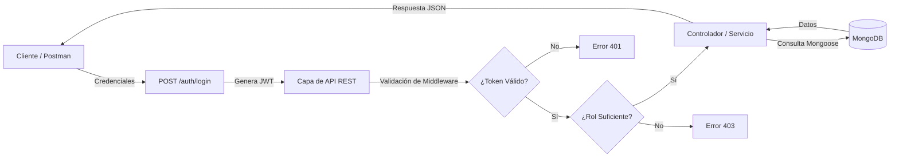

# API de Tickets

API REST de tickets con Express 5, Mongoose y autenticación con JWT.

## Tabla de contenidos

- [API de Tickets](#api-de-tickets)
  - [Tabla de contenidos](#tabla-de-contenidos)
  - [Descipción](#descipción)
    - [Flujo de funcionamiento](#flujo-de-funcionamiento)
  - [Características](#características)
  - [Requisitos Previos](#requisitos-previos)
  - [Instalación](#instalación)
  - [Modelos](#modelos)
  - [Autenticación](#autenticación)
  - [API REST](#api-rest)
    - [Paginación, filtros y ordenación](#paginación-filtros-y-ordenación)
    - [Códigos de estado](#códigos-de-estado)
    - [Ejemplos con curl](#ejemplos-con-curl)
  - [Colección de pruebas](#colección-de-pruebas)
  - [Estructura](#estructura)
  - [Scripts](#scripts)
  - [Testing](#testing)
  - [Authored](#authored)
  - [Co-authored-by;](#co-authored-by)
  - [Licencia](#licencia)

## Descipción

API RESTful para la creación, lectura, actualización y eliminación (CRUD) de tickets, con sistema de autenticación basado en JWT y control de roles.

### Flujo de funcionamiento



## Características

- ✅ CRUD completo de tickets (Crear, Leer, Actualizar, Borrar).

- ✅ Paginación, ordenamiento (sort) y filtrado (estado, prioridad).

- ✅ Autenticación de usuarios y generación de JWT (caducidad 1 hora).

- ✅ Autorización basada en roles (Usuarios estándar y Administradores).

- ✅ Tests de integración configurados con Jest y Supertest (Base de datos de prueba aislada).

- ✅ Colección de Postman con scripts de prueba y variables dinámicas.

- ✅ Bundling configurado con Webpack y Babel.

## Requisitos Previos

Antes de comenzar, asegúrate de tener instalado:

| Requisito | Descripción/Versión                        |
| --------- | ------------------------------------------ |
| `MONGODB` | Instancia local o cluster en MongoDB Atlas |
| `NPM`     | (Incluido con Node.js)                     |
| `NODE.JS` | v26.5.0 o superior                         |
| `Docker`  | Solamente si se utilizara como contenedor  |

## Instalación

1. Clonar el repositorio

```bash
  git clone https://github.com/irivasdz19/tickets.git
  cd tickets
```

2. Puesta en marcha

```bash
npm install
cp .env.example .env   # y completa MONGODB_URI y JWT_SECRET
npm run dev            # http://localhost:3000
```

Variables de entorno:

| Variable      | Descripción                            |
| ------------- | -------------------------------------- |
| `MONGODB_URI` | Cadena de conexión de MongoDB Atlas    |
| `PORT`        | Puerto del servidor (por defecto 3000) |
| `APP_NAME`    | Nombre mostrado al arrancar            |
| `JWT_SECRET`  | Secreto para firmar los tokens         |

Para generar un `JWT_SECRET`:

```bash
node -e "console.log(require('crypto').randomBytes(32).toString('hex'))"
```

## Modelos

```js
// Ticket
{
  titulo: String,     // obligatorio, 3-120 caracteres
  estado: String,     // "abierto" | "en progreso" | "cerrado"  (por defecto "abierto")
  prioridad: String,  // "alta" | "media" | "baja"              (por defecto "media")
  createdAt, updatedAt
}

// Usuario
{
  email: String,         // obligatorio, único, en minúsculas
  passwordHash: String,  // hash bcrypt; nunca se devuelve
  rol: String,           // "usuario" | "admin"  (por defecto "usuario")
  createdAt, updatedAt
}
```

## Autenticación

| Operación | Verbo  | Ruta             | Éxito | Devuelve             |
| --------- | ------ | ---------------- | ----- | -------------------- |
| Registro  | `POST` | `/auth/registro` | 201   | `{ id, email, rol }` |
| Login     | `POST` | `/auth/login`    | 200   | `{ token }`          |
| Quién soy | `GET`  | `/auth/yo`       | 200   | `{ id, email, rol }` |

El flujo es **registro → login → token → petición protegida**. El token se manda en cada petición:

```
Authorization: Bearer eyJhbGciOi...
```

Caduca en **1 hora**. El `rol` no se acepta desde el cuerpo del registro: todo usuario nace como `usuario` y el rol se otorga desde el servidor.

El login responde el mismo `Credenciales inválidas` tanto si el email no existe como si la contraseña es incorrecta, para no revelar qué correos están registrados.

## API REST

| Operación  | Verbo    | Ruta           | Éxito | Protección          |
| ---------- | -------- | -------------- | ----- | ------------------- |
| Crear      | `POST`   | `/tickets`     | 201   | Token               |
| Leer       | `GET`    | `/tickets`     | 200   | Pública             |
| Leer uno   | `GET`    | `/tickets/:id` | 200   | Pública             |
| Actualizar | `PATCH`  | `/tickets/:id` | 200   | Token               |
| Eliminar   | `DELETE` | `/tickets/:id` | 204   | Token + rol `admin` |

### Paginación, filtros y ordenación

`GET /tickets` acepta estos parámetros de consulta:

| Parámetro   | Por defecto  | Notas                                                                        |
| ----------- | ------------ | ---------------------------------------------------------------------------- |
| `page`      | `1`          | Entero ≥ 1                                                                   |
| `limit`     | `10`         | Entero entre 1 y 100                                                         |
| `estado`    | —            | `abierto`, `en progreso` o `cerrado`                                         |
| `prioridad` | —            | `alta`, `media` o `baja`                                                     |
| `sort`      | `-createdAt` | `titulo`, `estado`, `prioridad`, `createdAt`, `updatedAt`; `-` = descendente |

Respuesta:

```json
{
  "total": 42,
  "page": 1,
  "limit": 10,
  "tickets": [
    /* ... */
  ]
}
```

### Códigos de estado

| Situación                         | Código |
| --------------------------------- | ------ |
| Creado                            | 201    |
| OK (leer / actualizar)            | 200    |
| Eliminado (sin cuerpo)            | 204    |
| Entrada inválida                  | 400    |
| No autenticado (sin token válido) | 401    |
| Autenticado pero sin permisos     | 403    |
| No encontrado                     | 404    |
| Email ya registrado               | 409    |
| Error del servidor                | 500    |

La entrada inválida (falta `titulo`, `estado` fuera del `enum`, `id` mal formado, `page`/`limit` incorrectos) responde **400**, no 500: la culpa es del cliente.

**401 no es 403.** El 401 significa "no sé quién eres": falta el token o no es válido. El 403 significa "sé quién eres y no puedes": el token es correcto pero el rol no alcanza.

### Ejemplos con curl

```bash
# Registro
curl -X POST http://localhost:3000/auth/registro \
  -H "Content-Type: application/json" \
  -d '{"email":"ana@correo.com","password":"secreta123"}'

# Login: guarda el token
TOKEN=$(curl -s -X POST http://localhost:3000/auth/login \
  -H "Content-Type: application/json" \
  -d '{"email":"ana@correo.com","password":"secreta123"}' \
  | node -pe "JSON.parse(require('fs').readFileSync(0)).token")

# Crear (necesita token)
curl -X POST http://localhost:3000/tickets \
  -H "Authorization: Bearer $TOKEN" \
  -H "Content-Type: application/json" \
  -d '{"titulo":"Impresora sin red","prioridad":"alta"}'

# Listar filtrando y paginando (público)
curl "http://localhost:3000/tickets?estado=abierto&page=1&limit=5&sort=-createdAt"

# Actualizar (necesita token)
curl -X PATCH http://localhost:3000/tickets/<id> \
  -H "Authorization: Bearer $TOKEN" \
  -H "Content-Type: application/json" \
  -d '{"estado":"cerrado"}'

# Eliminar (necesita token de un usuario con rol admin)
curl -i -X DELETE http://localhost:3000/tickets/<id> \
  -H "Authorization: Bearer $TOKEN"
```

## Colección de pruebas

`postman/API-Tickets.postman_collection.json` — impórtala en Postman.
Incluye el registro y el login, los cinco endpoints del CRUD, los casos de paginación/filtros y los errores (400, 401, 403, 404 y 409).

La colección manda `Authorization: Bearer {{token}}` heredado en todos los requests; los públicos y los de error lo sobrescriben. Tres variables se rellenan solas al ejecutarla en orden:

| Variable     | La rellena     |
| ------------ | -------------- |
| `token`      | _Login_        |
| `tokenAdmin` | _Login admin_  |
| `ticketId`   | _Crear ticket_ |

_Login admin_ necesita un usuario con rol `admin`: regístralo primero y cámbiale el rol en la base, porque la API no permite autoconcederse permisos.

## Estructura

```
src/
  server.js              # app, middlewares y arranque
  data/db.js             # conexión a MongoDB
  models/tickets.js      # esquema de Ticket + validaciones
  models/usuarios.js     # esquema de Usuario + roles
  routes/tickets.js      # API REST de tickets
  routes/auth.js         # registro, login y /auth/yo
  middlewares/errores.js # 404 y manejador central de errores
  middlewares/auth.js    # firmarToken, requireAuth y requireRol
postman/                 # colección de pruebas
test/
  auth.test.js           #Prueba de autenticación
  health.test.js         #Prueba de salud de la api
  tickets.test.js        #Prueba de Tickets
Dockerfile               #Configuración para la creación de la imagen Docker
docker-compose.yml       #Orquestación de contenedores (App + BD)
```

## Scripts

| Script               | Qué hace                                                  |
| -------------------- | --------------------------------------------------------- |
| `npm run dev`        | Servidor con `--watch`                                    |
| `npm run build:dev`  | Bundle de desarrollo con webpack                          |
| `npm run build:prod` | Bundle de producción                                      |
| `npm start`          | Ejecuta el bundle de `dist/`                              |
| `npm test`           | Ejecuta la suite de pruebas usando .env.test y VM Modules |

## Testing

El proyecto incluye pruebas de integración que validan el ciclo de vida de usuarios y tickets.

```bash
npm run test
```

Nota: El script inyecta automáticamente la bandera --experimental-vm-modules para soportar importaciones ESM y utiliza las variables del archivo .env.test para no contaminar la base de datos principal.

## Authored

Ignacio Rivas D. — Desarrollo de API REST y Tests — @irivasdz19

## Co-authored-by;

Brayan Diaz C. — @brayandiazc

## Licencia

Este proyecto está bajo la licencia ISC.

⌨️ con ❤️ por @irivasdz19
