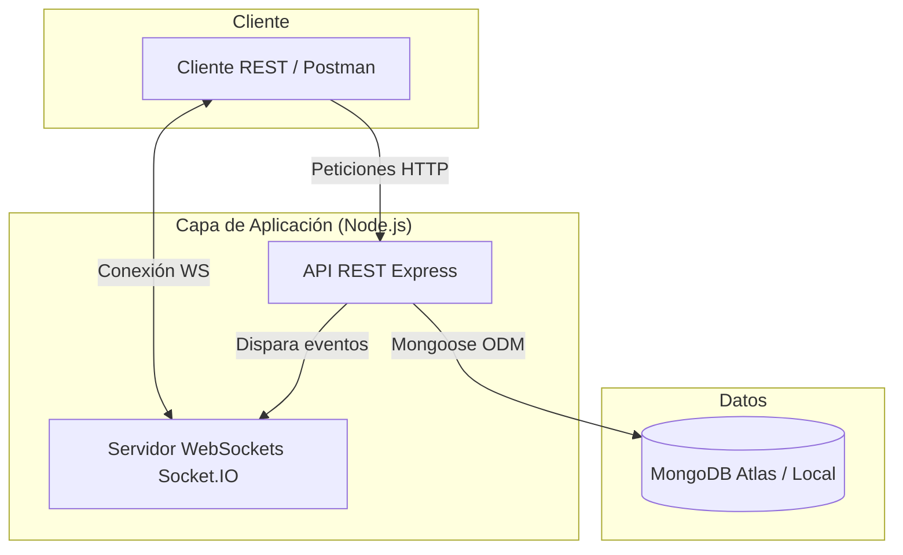
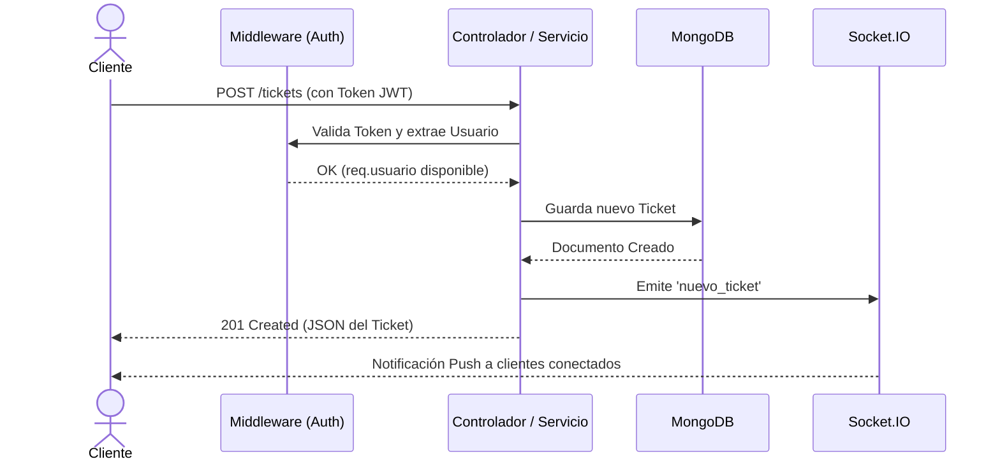

# API Tickets — Arquitectura

> Vista de alto nivel de cómo está construido el sistema y cómo se reparten las
> responsabilidades. Para el stack real (versiones, librerías) ver
> [`stack.md`](stack.md).
>
> **Última actualización**: 2026-08-06

## Diagrama

## Componentes

| Componente                   | Responsabilidad                                                                                                                            | Tecnología                       |
| ---------------------------- | ------------------------------------------------------------------------------------------------------------------------------------------ | -------------------------------- |
| Middlewares (Seguridad/Auth) | Interceptan peticiones para inyectar cabeceras seguras, habilitar CORS, validar JWT y autorizar roles antes de llegar a los controladores. | Express.js, Helmet, jsonwebtoken |
| Enrutador y Controladores    | Exponen la interfaz REST (/auth, /tickets). Reciben peticiones, delegan la lógica al servicio y formatean las respuestas HTTP.             | Express.js 5                     |
| Capa de Servicios / Modelos  | Encapsulan la lógica de negocio y las reglas de validación estricta de la base de datos (enums, campos requeridos, paginación).            | Mongoose ODM                     |
| Motor de Tiempo Real         | Emite eventos de notificación (push) a los clientes conectados cuando ocurre una mutación en los tickets (creación, edición, borrado).     | Socket.IO                        |
| Infraestructura Contenedores | Aísla la aplicación y su base de datos para garantizar que el entorno de ejecución sea idéntico en desarrollo y producción.                | Docker, Docker Compose           |

## Decisiones clave

| Decisión                                               | Razón                                                                                                                                                               |
| ------------------------------------------------------ | ------------------------------------------------------------------------------------------------------------------------------------------------------------------- |
| Arquitectura por capas (Rutas, Controladores, Modelos) | Separa las responsabilidades, evita el código espagueti en los endpoints y facilita la creación de pruebas de integración aisladas.                                 |
| Uso de JWT sobre Sesiones con Cookies                  | Mantiene la API stateless (sin estado), facilitando la escalabilidad y simplificando el consumo desde cualquier tipo de cliente (móvil, web, CLI).                  |
| Despliegue con Docker Compose                          | Integra de manera limpia la API de Node.js y la base de datos de MongoDB en un solo comando (docker-compose up), eliminando fricciones de configuración de entorno. |

> El detalle y las alternativas de cada decisión relevante se registran como
> ADRs en [`../decisions/`](../decisions/README.md).

## Reglas no negociables

- Inmutabilidad de roles en registro: Es imposible que un usuario se auto-conceda el rol admin al registrarse. Todo usuario nace con rol usuario.
- Privacidad de contraseñas: El passwordHash jamás debe viajar en ninguna respuesta JSON (ni siquiera en el perfil del usuario /auth/yo).
- Validación temprana: Las peticiones mal formadas deben fallar con 400 Bad Request antes de tocar la base de datos. Se delega la validación estricta del esquema a Mongoose.
- Protección de escritura: Cualquier endpoint que mute estado (POST, PATCH, DELETE en /tickets) requiere obligatoriamente un token JWT válido. El borrado (DELETE) es de uso exclusivo para el rol admin.

## Flujos principales

## Referencias

- [`stack.md`](stack.md) — stack tecnológico y versiones.
- [`database.md`](database.md) — modelo de datos.
- [`auth.md`](auth.md) — autenticación y autorización.
- [`api.md`](api.md) — contrato de API.
