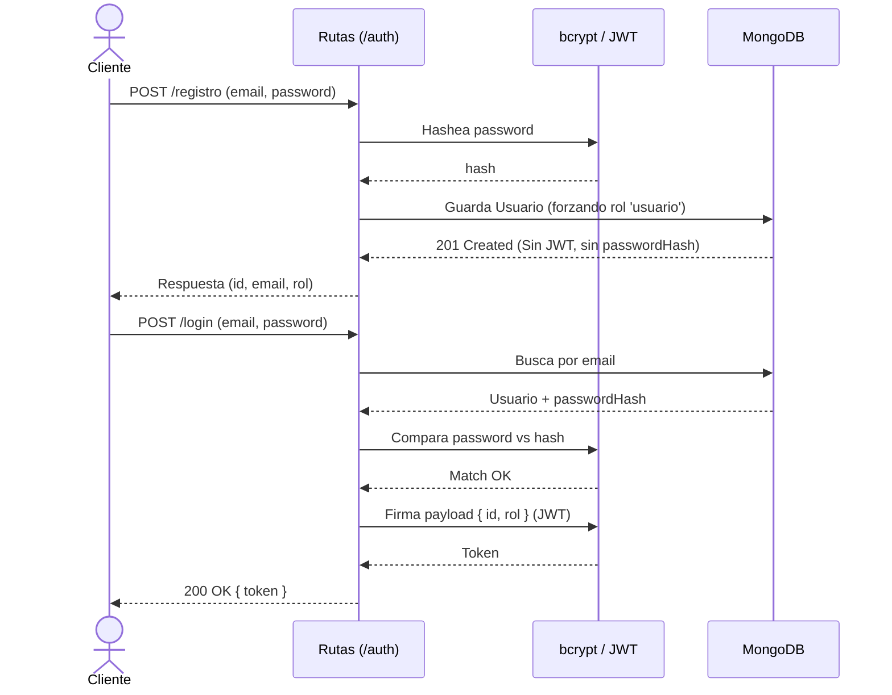

# Autenticación y Autorización

> Cómo se autentican y autorizan los usuarios en **API Tickets**.
> Para las reglas transversales ver [`../conventions/authentication.md`](../conventions/authentication.md).
>
> **Última actualización**: 2026-08-06

## Visión general

- **Método de autenticación**: JSON Web Tokens (JWT).
- **Almacenamiento de credenciales**: Base de datos (MongoDB) en la colección `usuarios`. El token JWT viaja en la cabecera `Authorization: Bearer <token>` de cada petición protegida.
- **Hashing de contraseñas**: `bcrypt` (Salts integrados, jamás se almacena la contraseña en texto plano).

## Modelo de identidad

| Concepto       | Descripción                                                                                                                                                |
| -------------- | ---------------------------------------------------------------------------------------------------------------------------------------------------------- |
| Usuario        | Representa una identidad en el sistema. Los campos clave son `email` (único, normalizado en minúsculas) y `rol`. El `passwordHash` se maneja internamente. |
| Sesión / Token | No hay sesiones persistidas en base de datos. Se utiliza un JWT _stateless_ firmado con el `JWT_SECRET` del servidor.                                      |
| Roles          | `usuario` (rol base por defecto) y `admin` (rol privilegiado, asignado manualmente en la BD).                                                              |

## Flujo de registro / login

## Gestión de sesiones / tokens

- **Expiración**: El JWT tiene un TTL (Time To Live) estricto de 1 hora.
- **Renovación**: Actualmente no hay flujo de refresh token. El usuario debe volver a iniciar sesión (/auth/login) tras la caducidad.
- **Revocación**: Al ser JWT stateless, los tokens no se pueden revocar directamente antes de su expiración. La seguridad recae en la corta vida útil (1 hora).

## Autorización

- **Modelo**: RBAC (Role-Based Access Control).
- **Dónde se valida**: Siempre en el servidor, en cada request, a través de los middlewares requireAuth (verifica la firma del JWT) y requireRol (comprueba permisos).
- **Roles y permisos**:

| Rol     | Permisos                                                                                 |
| ------- | ---------------------------------------------------------------------------------------- |
| usuario | Autenticación básica. Puede crear (POST), listar (GET) y actualizar (PATCH) tickets.     |
| admin   | Todos los permisos del usuario + permisos destructivos: Puede eliminar tickets (DELETE). |

## Consideraciones de seguridad

- Prevención de enumeración de usuarios: El endpoint /auth/login responde siempre con un 401 Credenciales inválidas genérico, independientemente de si el fallo fue porque el email no existe o porque la contraseña es incorrecta.

- Inmutabilidad de roles: El endpoint /auth/registro ignora activamente el campo rol si se envía en el body. Es imposible autoconcederse permisos de admin al crear una cuenta.

- Filtrado de datos: Ninguna respuesta de la API (ni registro, ni perfil en /auth/yo) expone el campo passwordHash.
