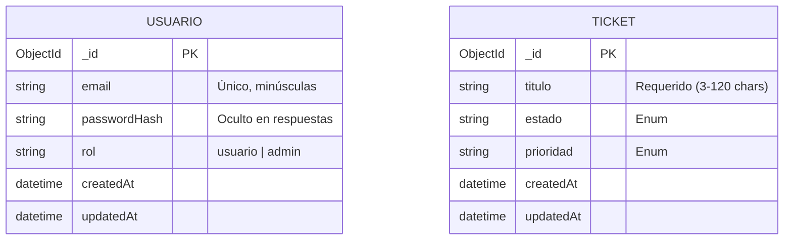

# Modelo de Datos

> Esquema, entidades y relaciones de **API Tickets**.
> Para las **reglas y estándares** de modelado (nomenclatura, tipos, índices)
> ver [`../conventions/database.md`](../conventions/database.md).
>
> **Última actualización**: 2026-08-06

## Diagrama Entidad-Relación

Al utilizar MongoDB (NoSQL), modelamos a través de colecciones y documentos validados por Mongoose. En esta iteración de la API, las colecciones operan de manera independiente.

## Entidades principales

### Usuario

- **Propósito**: Representa a las personas registradas en el sistema capaces de interactuar con la API mediante autenticación JWT.
- **Campos clave**:
  - email (String) — Identificador de acceso, debe ser único y se normaliza a minúsculas.
  - passwordHash (String) — Contraseña encriptada con bcrypt. Nunca debe devolverse al cliente.
  - rol (String) — Determina los permisos. Valores permitidos: usuario, admin. Por defecto: usuario.

### Ticket

- **Propósito**: Representa un incidente, requerimiento o tarea gestionada por el sistema.
- **Campos clave**:
  - titulo (String) — Nombre o resumen del problema (min 3, max 120 caracteres).
  - estado (String) — Situación actual del ticket. Valores permitidos: abierto, en progreso, cerrado. Por defecto: abierto.
  - prioridad (String) — Nivel de urgencia. Valores permitidos: alta, media, baja. Por defecto: media.

## Relaciones y cardinalidad

| Relación       | Cardinalidad | Notas                                                                                    |
| -------------- | ------------ | ---------------------------------------------------------------------------------------- |
| Independientes | N/A          | EN el alcance actual, los ticket son de acceso global no están amarrados a un usuario_id |

## Índices y restricciones

- Índice Único en Usuario: El campo email en la colección usuarios tiene un índice unique: true de Mongoose para garantizar que no existan cuentas duplicadas a nivel de motor de base de datos.
- Restricciones Enum: Los campos estado y prioridad en los tickets están restringidos estrictamente a los valores de sus respectivos enumeradores para evitar datos sucios.
- Validación de Strings: Mongoose restringe la longitud del titulo del ticket para evitar inserciones de texto excesivamente largas o vacías.

## Migraciones y versionado del esquema

- Al utilizar MongoDB con Mongoose (ODM), el esquema o "schema" se aplica a nivel de aplicación (código Node.js).
- No se utilizan comandos ni librerías de migraciones pesadas (tipo Flyway o Knex) ya que MongoDB crea las colecciones dinámicamente y Mongoose fuerza la validación de estructura al vuelo durante las operaciones de escritura.

## Datos semilla (seeds)

- Actualmente no se requiere un comando automatizado para seeding.
- Configuración del Administrador: Para obtener permisos destructivos, se debe registrar un usuario normal vía API (POST /auth/registro) y luego editar el documento manualmente en MongoDB Atlas o MongoDB Compass para cambiar el campo rol de "usuario" a "admin".
